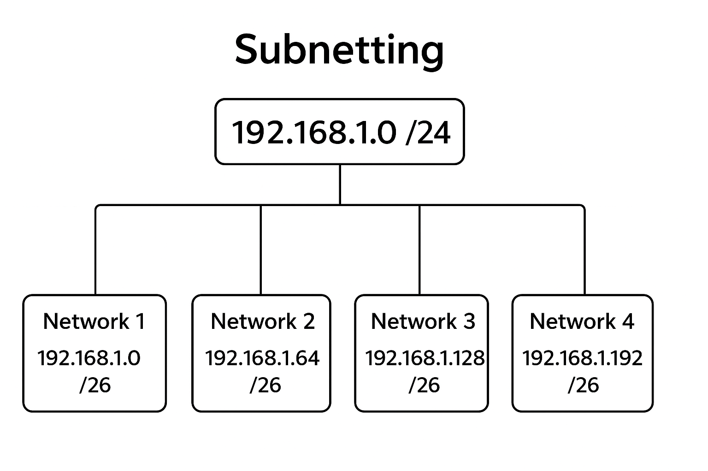

# 🌐 IP Addressing and Subnetting — From Basics to Binary Logic

---

## 🧭 What Is an IP Address?

An **IP address (Internet Protocol address)** is a logical address used at the **Layer 3 (Network Layer)** of the **OSI model** and in the **Internet Layer** of the **TCP/IP model**.  
It uniquely identifies devices on a network and enables communication across the internet.

---

### 🌍 Types of IP Addresses

| Type | Description | Example |
|:------|:-------------|:----------|
| **Private IP** | Used **inside** local networks (LANs). Not routable on the internet. |
| **Public IP** | Used **outside** LANs to connect to the internet. Assigned by ISPs. |

💡 Our **router** has the public IP.  
All devices inside our LAN share it for internet access through **NAT (Network Address Translation)**.

---

## 🧩 IP Address Classes

IPv4 addresses are divided into five classes (A–E).  
Classes **A, B, and C** are commonly used; **D** and **E** are reserved for special purposes.

| Class | Starting Range | Ending Range | Default Subnet Mask | CIDR | Purpose |
|:------|:----------------|:---------------|:----------------------|:------|:----------|
| **A** | 1.0.0.0 | 126.255.255.255 | 255.0.0.0 | /8 | Very large networks |
| **B** | 128.0.0.0 | 191.255.255.255 | 255.255.0.0 | /16 | Medium networks |
| **C** | 192.0.0.0 | 223.255.255.255 | 255.255.255.0 | /24 | Small networks (LANs) |
| **D** | 224.0.0.0 | 239.255.255.255 | — | — | Multicasting |
| **E** | 240.0.0.0 | 255.255.255.255 | — | — | Experimental & reserved |

---

## 🔢 What Is CIDR?

**CIDR (Classless Inter-Domain Routing)** notation is a shorthand way to show how many bits are used for the **network portion**.

Example:

- `/26` → means 26 bits for **network**
- 32 - 26 = 6 bits → for **host**
- CIDR replaced class-based systems to give **more flexibility**

---

## 🧮 What Is a Subnet Mask?

A **subnet mask** defines which portion of an IP address identifies the **network** and which part identifies the **host** (device).

### 🌐 Network Part vs Host Part

An IP address has two main parts:

| Part | Description | Example (192.168.1.10/26) |
|:-----|:-------------|:---------------------------|
| **Network Part** | Identifies the specific network. All devices in the same network share this part. | `192.168.1.0` |
| **Host Part** | Identifies a unique device (host) within that network. | `.10` |

Each subnet mask is a sequence of **1s** (network bits) followed by **0s** (host bits).  
It helps routers separate network and host portions in an IP.

Example:

  **IP: 192.168.1.0**
  
  **Subnet Mask: 255.255.255.0 → Binary: 11111111.11111111.11111111.00000000**
- **1s** → Network part  
- **0s** → Host part

---

### 🧠 How We Get “192” in a Subnet Mask

Let’s take an example:  
Subnet Mask: **255.255.255.192**
Binary: **11111111.11111111.11111111.11000000**

In the **last octet**, the first **two bits are 1s** and the remaining six are 0s.

Each bit in the last octet represents:

| Bit position | 128 | 64 | 32 | 16 | 8 | 4 | 2 | 1 |
|:---------------|:----|:----|:----|:----|:----|:----|:----|:----|
| Example (192) | 1 | 1 | 0 | 0 | 0 | 0 | 0 | 0 |

Add the values of the **network bits** (1s):
                                          128 + 64 = 192

✅ Therefore, **255.255.255.192** means:
- Network bits → 26 (first 26 bits are 1)
- Host bits → 6 (remaining bits are 0)

That’s how we get **/26 (CIDR)** and this mask.

---

### 🧩 Binary Visual Example

Here’s how `255.255.255.192` looks in binary:
Network: **11111111.11111111.11111111.11**
Host: **000000**

So:

**11111111.11111111.11111111.11000000**
→ **255.255.255.192**
→ **/26**

This visual clearly shows **where the network ends and host begins**.

---

## 🧮 Understanding Binary and Decimal Conversion

Computers understand only **binary (0s and 1s)**, while we humans use **decimal (0–9)**.  
An IP address is made of **32 bits**, divided into **4 octets (8 bits each)**.

Each octet of an IPv4 address has **8 bits**, with each bit representing a power of 2.

| Bit Position | 128 | 64 | 32 | 16 | 8 | 4 | 2 | 1 |
|:-------------:|:---:|:--:|:--:|:--:|:--:|:--:|:--:|:--:|

### ➡️ Decimal → Binary Example
`192` → `128 + 64` → **11000000**

### ⬅️ Binary → Decimal Example
`11000000` → `128 + 64 = 192`

---

## 🧭 What Is Subnetting?

**Subnetting** divides one big network into smaller logical networks (subnets).  

### 💡 Why We Subnet

- Better **IP utilization** (no wasted addresses)  
- Improved **performance** (less broadcast traffic)  
- **Security** isolation (different departments = different subnets)  
- Easier **management and troubleshooting**
---

## ⚙️ Subnetting Example: 192.168.1.0/24 → 4 Subnets

### 🎯 Goal
Create **4 subnets** from the Class C network `192.168.1.0/24`.

---

### Step 1: Given Info
- Network: `192.168.1.0`
- Default Mask: `255.255.255.0 (/24)`
- Need: 4 subnets

---

### Step 2: Determine Bits to Borrow
Formula: 2ⁿ = Number of Subnets

To get 4 subnets → `2² = 4`, so we **borrow 2 bits**.

---

### Step 3: New Subnet Mask
Borrowing 2 bits from host portion:

**11111111.11111111.11111111.11000000**

→ **New mask = 255.255.255.192 (/26)**  
→ 128 + 64 = 192 (network bits)

---

### Step 4: Increment Value
The increment is the value of the **last borrowed bit**.

64 → Increment = 64

**OR**

256 - 192 = 64 → Increment = 64

### 📊 Step 5: Subnet Table

| Subnet | Network | First Usable | Last Usable | Broadcast | Range |
|:-------|:----------|:--------------|:--------------|:------------|:----------|
| 1 | 192.168.1.0 | 192.168.1.1 | 192.168.1.62 | 192.168.1.63 | 0–63 |
| 2 | 192.168.1.64 | 192.168.1.65 | 192.168.1.126 | 192.168.1.127 | 64–127 |
| 3 | 192.168.1.128 | 192.168.1.129 | 192.168.1.190 | 192.168.1.191 | 128–191 |
| 4 | 192.168.1.192 | 192.168.1.193 | 192.168.1.254 | 192.168.1.255 | 192–255 |

### 🧾 Step 6: Hosts Calculation
Host bits = 6

2⁶ = 64 total IPs

64 - 2 = 62 usable hosts

✅ 62 usable IPs per subnet  
✅ 4 subnets created  
✅ Increment = 64

---

### Step 7: Summary
| Concept | Value |
|:----------|:----------|
| Network bits | 26 |
| Host bits | 6 |
| Subnet Mask | 255.255.255.192 |
| CIDR | /26 |
| Total Subnets | 4 |
| Usable Hosts Per Subnet | 62 |

---

## 💡 Quick Formulas to Remember

| Purpose | Formula |
|:----------|:----------|
| Number of Subnets | 2ⁿ (n = borrowed bits) |
| Hosts per Subnet | 2ʰ − 2 (h = remaining host bits) |
| Total IPs per Subnet | 2ʰ |

---

## 🧠 Final Recap

- IP addresses identify devices logically on networks.  
- Subnet mask divides the IP into **network** and **host** parts.  
- Binary is used because computers work with bits (0s and 1s).  
- CIDR provides flexibility in defining networks.  
- Subnetting helps optimize, secure, and organize networks.

---

## 🧩 Practice Challenge
Try this on your own:
> Subnet `192.168.10.0/24` into 8 subnets.  
> Find:
> - New subnet mask  
> - Increment  
> - All subnet ranges  
> - Usable hosts per subnet  

---

**Purpose:** For Networking & Subnetting learners who want clarity and correctness.
