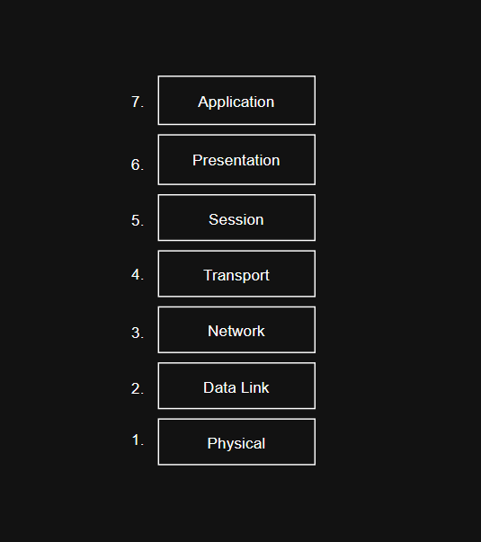

# OSI Model (Open Systems Interconnection Model)

The **OSI Model** is a reference model that describes how data travels across a network in **7 layers**.  
Each layer has its own role and interacts with the layers directly above and below it.

---

## 1. Physical Layer (L1)
- **Function:** Transmits raw bits (0s and 1s) over a physical medium.  
- **Mediums:** Cables or wireless.  
- **Data unit:** Bits.  
- **Examples:**
  - Voltage/electrical signals → Ethernet cables (copper)
  - Light signals → Fiber optic cables
  - Radio waves → Wi-Fi (WAP – Wireless Access Point), Bluetooth  
- **Real-world example:** Plugging in an Ethernet cable to connect your PC to the internet.

---

## 2. Data Link Layer (L2)
- **Function:** Ensures reliable delivery between devices in the same local network.  
- **Addressing:** Uses **MAC addresses** (unique hardware addresses of network cards).  
- **Data unit:** Frames.  
- **Devices:** Switches, NIC (Network Interface Card).  
- **Protocols/Technologies:** Ethernet, ARP, PPP, VLAN.  
- **Real-world example:** Your laptop and Wi-Fi router talking via MAC address.

---

## 3. Network Layer (L3)
- **Function:** Moves data between different networks using logical addressing.  
- **Addressing:** Uses **IP addresses**.  
- **Tasks:** Handles routing (finding the best path).  
- **Data unit:** Packets.  
- **Devices:** Routers, Layer 3 switches.  
- **Protocols:** IPv4, IPv6, ICMP, OSPF, BGP.  
- **Real-world example:** Sending data from India to the US via IP.

---

## 4. Transport Layer (L4)
- **Function:** Provides end-to-end communication between applications.  
- **Addressing:** Uses **port numbers** to identify services.  
- **Data unit:** Segments (TCP) / Datagrams (UDP).  
- **Main protocols:**
  - **TCP (Transmission Control Protocol):** Reliable, uses 3-way handshake, error detection, retransmission.
  - **UDP (User Datagram Protocol):** Faster, not reliable, used in streaming/gaming.  
- **Real-world example:** Watching YouTube → TCP for loading the page, UDP for streaming the video.

---

## 5. Session Layer (L5)
- **Function:** Manages sessions (opening, maintaining, closing communication).  
- **Examples:**
  - Like a phone call → setup, conversation, hang up.
  - Session IDs in web apps.
- **Protocols/Technologies:** NetBIOS, RPC (Remote Procedure Call).

---

## 6. Presentation Layer (L6)
- **Function:** Translates data into a format the application can understand.  
- **Tasks:**
  - Translation (ASCII ↔ Unicode).
  - Encryption/Decryption (TLS/SSL).
  - Compression/Decompression (JPEG, MP3, MPEG).  
- **Real-world example:** Watching a Netflix movie → video is compressed, encrypted, and translated for your app.

---

## 7. Application Layer (L7)
- **Function:** Closest to the user, provides services directly to applications.  
- **Examples:**
  - HTTP/HTTPS → Web browsing
  - SMTP, POP3, IMAP → Email
  - FTP, SFTP → File transfer
  - SSH, RDP → Remote access  
- **Real-world example:** Browsing a website using HTTPS.

---

# ✅ Quick Summary Table

| Layer | Data Unit | Addressing | Example Protocols | Devices | Real-World Example |
|-------|-----------|------------|-------------------|---------|---------------------|
| L7 – Application | Data | — | HTTP, FTP, SMTP, DNS | — | Browsing a website |
| L6 – Presentation | — | — | TLS/SSL, JPEG, MPEG | — | Netflix encrypting & compressing video |
| L5 – Session | — | — | NetBIOS, RPC | — | Logging into a web app (Session ID) |
| L4 – Transport | Segments/Datagrams | Ports | TCP, UDP | — | YouTube (TCP for page, UDP for video) |
| L3 – Network | Packets | IP | IPv4, IPv6, ICMP, OSPF, BGP | Routers | Sending data India → US |
| L2 – Data Link | Frames | MAC | Ethernet, ARP, VLAN | Switches, NICs | Laptop ↔ Router (MAC) |
| L1 – Physical | Bits | N/A | Ethernet, Wi-Fi | Cables, Hubs | Ethernet cable signals |

---

# 📌 Notes
- Each layer only communicates with the layer directly above and below it.  
- OSI is a **conceptual model** → Real networks often follow the **TCP/IP model** (which maps to OSI).  
- Understanding OSI helps you troubleshoot networking issues layer by layer.

---
