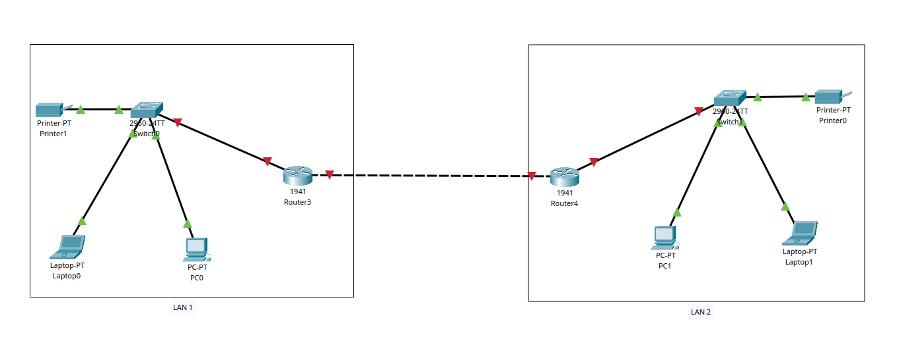

# 🌐 What is Networking?

Networking is simply about connecting devices together so they can communicate and share resources.

A network can be as small as two devices connected with a cable, or as large as the entire Internet, which connects millions of devices worldwide.

## 👉 In simple words:
A network is a collection of devices connected to each other for the purpose of sharing resources, information, and communication.

### These devices can include:

* Computers & Laptops

* Smartphones & Tablets

* Routers & Switches

* Printers, Servers, Smart TVs, and more

## 🔸 Why do we use Networking?

### Networking allows us to:

* Share data and files (documents, videos, photos)

* Make voice calls and video calls (Zoom, WhatsApp, Teams)

* Access the Internet (browsing, gaming, streaming)

* Use shared resources (like printers or cloud storage)

## 🔸Example

When you connect your phone, laptop, and TV to your home Wi-Fi, they are all part of a LAN (Local Area Network).

*Now imagine:*

- Your LAN connects to your neighbor’s LAN,

- Many LANs connect together into bigger networks (like offices, schools, ISPs),

- Multiple LANs and WANs (Wide Area Networks) across the world connect together…

`LAN  →  Multiple LANs  →  WAN  →  Internet`

### A good way to think about it:

👉 At home, all your devices (laptops, phones, smart TVs) connect to your Wi-Fi. This is your Local Area Network (LAN).
👉 When many LANs connect to each other, we get larger networks like Wide Area Networks (WANs).
👉 All these LANs and WANs around the world interconnect to form the Internet – a massive global network of networks.

## 📌 Example: Connecting Two LANs

Below is a simple network diagram showing how two LANs can be connected using routers:

Simple diagram showing two LANs connected via routers.
> *⚠️ Note: The devices in this diagram are not yet configured, so the links appear in red.*

> *💡 Routers enable different LANs to communicate with each other.*
