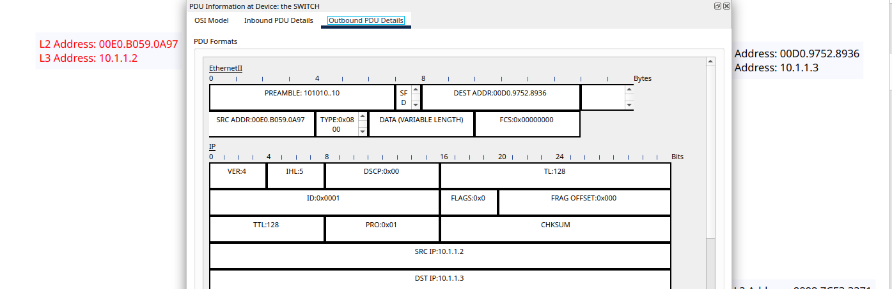
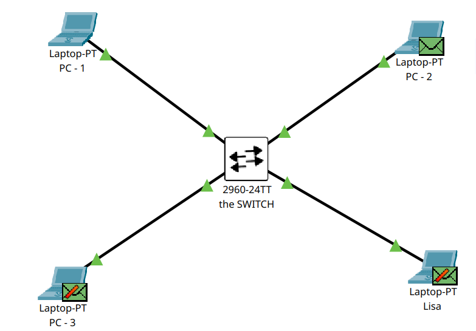
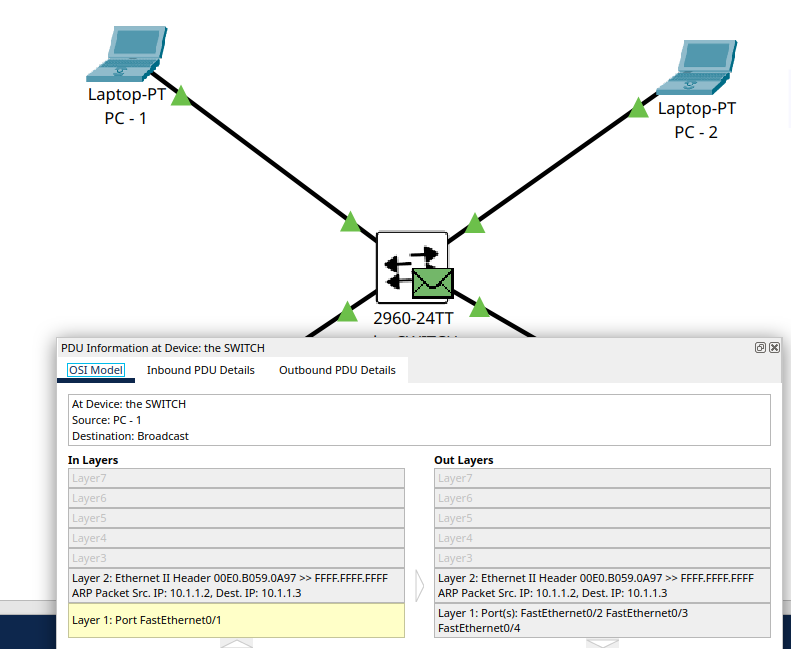

# Switching in Networking

## 📌 What is Switching?
A **switch** operates at **Layer 2 (Data Link Layer)** of the OSI model.  
It forwards **frames** between devices based on **MAC addresses**.

---
📌 **Reminder:**  
At the **Data Link Layer (Layer 2)**, the data unit is called a **frame**.  
A frame contains:  
- Source MAC address  
- Destination MAC address  
- Data (payload)  

👉 Frames are what switches use to forward traffic.  
(See [OSI Model](../OSI_Model.md) for a full breakdown of layers and data units.)

---

## ⚡ How Switching Works
1. **Frame Creation**  
   - A device (e.g., PC1) sends data to PC2.  
   - The frame contains:  
     - **Source MAC** (PC1)  
     - **Destination MAC** (PC2)
       
       
       
2. **Switch Checks MAC Table (CAM Table)**  
   - If the **destination MAC is known**, the frame is sent **only to that port**.  
   - If the **MAC is unknown**, the switch **floods** the frame to all ports except the incoming one.

      

3. **Learning Process**  
   - The switch learns MAC addresses by recording the **source MAC** of each frame in its **Content Addressable Memory (CAM) table** along with the port.  

4. **ARP in Action**  
   - If PC1 knows PC2’s **IP address** but not its MAC, it sends an **ARP Request**.  
   - ARP Request is a **broadcast frame** with destination `FFF.FFF.FFF.FFF`(Broadcast MAC Address).

     
    
   - PC2 responds with its MAC, and the switch learns both MACs during this exchange.

     

---

## 🔑 Key Features of Switching
- **Flooding** → Sends frames to all ports when destination MAC is unknown.  
- **Learning** → Builds CAM table using source MACs.  
- **Forwarding** → Sends frames directly to the correct port (unicast).  
- **Broadcasting** → Used for ARP, DHCP requests, etc.  

---

## 🖼️ Example Flow
- PC1 wants to ping PC2.  
- PC1 sends ARP Request (`FFF.FFF.FFF.FFF`) → Switch floods it.
- PC2 replies with its MAC → Switch learns PC2’s MAC in CAM table.  
- Now PC1 ↔ PC2 communication goes directly via their ports (no flooding needed).  

---

✅ **Summary:**  
Switching = **Flood → Learn → Forward**  
